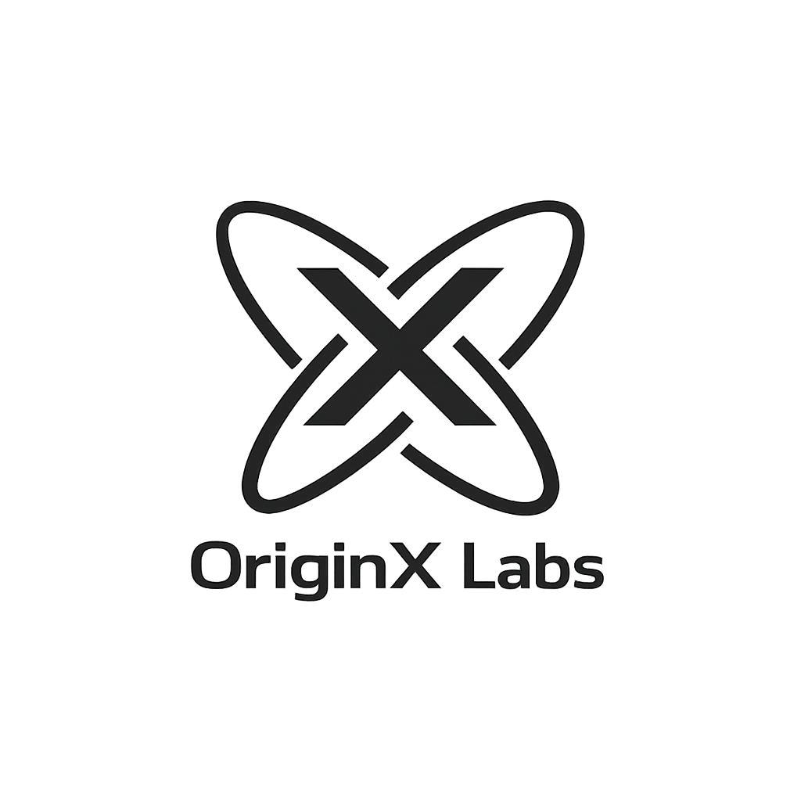
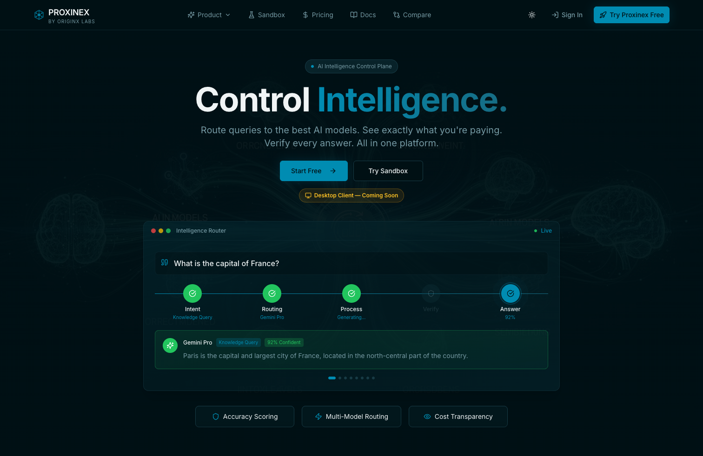
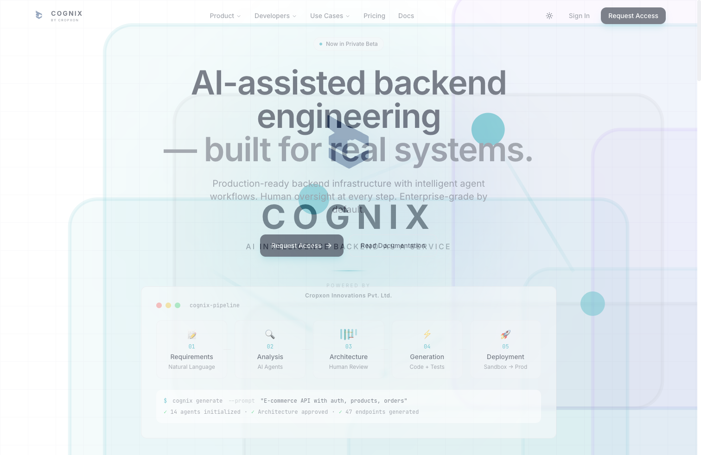
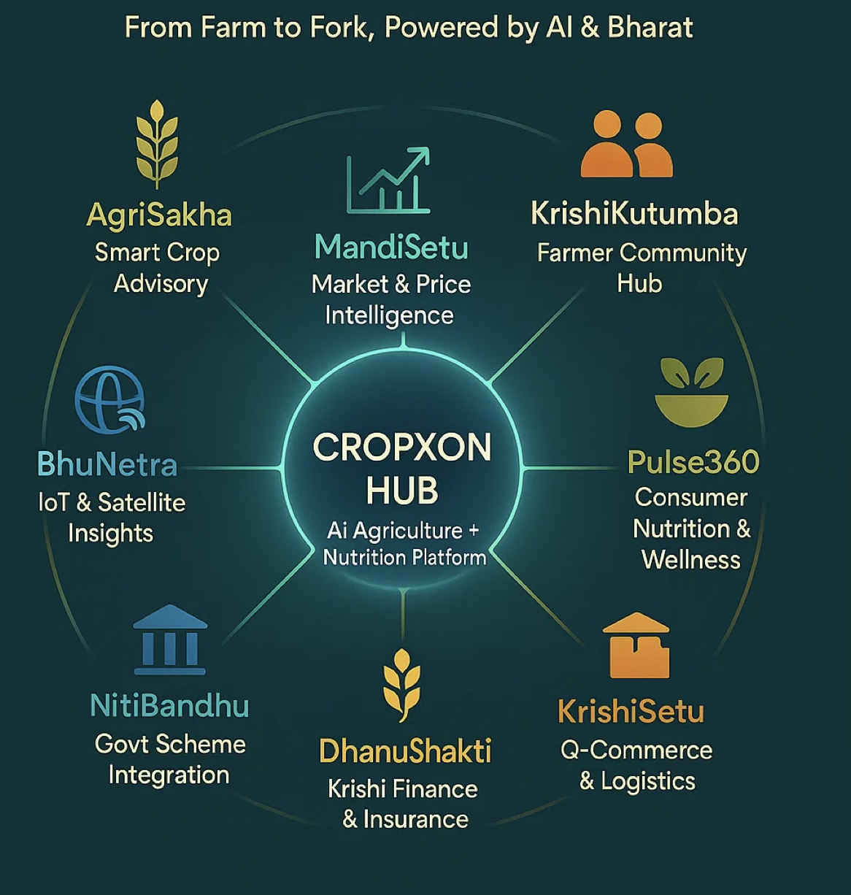

# OriginX Labs

<p align="center">
  
</p>

<p align="center">
  Agentic AI company building animated, enterprise-grade SaaS platforms for autonomous operations, intelligent infrastructure, and applied AI products.
</p>

<p align="center">
  <a href="https://originxlabs.com">Website</a> •
  <a href="https://originxlabs.com/cropxon">CropXon</a> •
  <a href="https://www.cropxon.com/">CropXon External</a>
</p>

<p align="center">
  
  
  
  
  
  
</p>

## Overview

OriginX Labs is the official web platform for **OriginX Labs Pvt. Ltd.**, designed as a modern SaaS-style experience for an agentic AI company. The site combines motion-driven storytelling, product-led navigation, platform architecture pages, solution pages, and branded microsites into one polished frontend.

This repository powers:

- The main OriginX Labs company site
- Product pages for the AI and enterprise SaaS suite
- Platform and solutions pages
- Service ecosystem pages
- The CropXon agriculture intelligence microsite

## Preview

### Hero / Motion Preview

<p align="center">
  <video src="./src/assets/oxl-hero-video.mp4" width="100%" controls muted playsinline preload="metadata"></video>
</p>

### Brand / Product Preview

<p align="center">
  <video src="./src/assets/video2-ox.mp4" width="100%" controls muted playsinline preload="metadata"></video>
</p>

### Product Experience Snapshots

<p align="center">
  
</p>

<p align="center">
  
  
</p>

<p align="center">
  
</p>

If your Git host does not render embedded videos in Markdown, open the source files directly:

- `src/assets/oxl-hero-video.mp4`
- `src/assets/video2-ox.mp4`

## What This Site Communicates

- **Agentic positioning** with messaging around autonomous operations, enterprise AI, LLM systems, and intelligent infrastructure
- **Animated storytelling** through splash screens, parallax sections, interactive showcases, hover cards, and motion-led hero content
- **Multi-product navigation** for the OriginX Labs ecosystem
- **SaaS-grade presentation** with brand-led product pages, platform trust messaging, and enterprise solution flows
- **Microsite support** for domain-specific products like CropXon

## Product Ecosystem

### Core Products

| Product | Route | Focus |
| --- | --- | --- |
| PROXINEX | `/products/proxinex` | AI intelligence control plane |
| COGNIX | `/products/cognix` | AI backend as a service |
| ORIGINX ONE | `/products/originx-one` | Unified API and capability layer |

### Ecosystem and Services

| Experience | Route |
| --- | --- |
| CropXon | `/cropxon` |

## Route Map

### Main

- `/`
- `/about`
- `/leadership`
- `/consulting`
- `/trust`
- `/press`
- `/careers`
- `/contact`

### Platform

- `/platform/architecture`
- `/platform/intelligence`
- `/platform/autonomy`
- `/platform/security`
- `/platform/integrations`
- `/platform/huminex`

### Solutions

- `/solutions/enterprise`
- `/solutions/autonomous`
- `/solutions/regulated`
- `/solutions/scale`
- `/solutions/experience`

### Legal

- `/privacy`
- `/terms`
- `/refund-policy`

## Experience Highlights

- Animated splash screen on initial load and route transitions
- Motion-rich hero with rotating messaging and product-linked cards
- Parallax product showcase and multi-section storytelling
- Theme support with `next-themes`
- SEO-focused metadata and structured schema markup
- Chatbot integration for on-site interaction
- SPA deployment support for Vercel and Netlify

## Tech Stack

- React 18
- TypeScript
- Vite 5
- Tailwind CSS
- GSAP
- React Router v6
- TanStack Query
- Radix UI
- `next-themes`
- Vitest + Testing Library

## Getting Started

### Requirements

- Node.js 18+
- npm

### Install

```bash
npm install
```

### Run Development Server

```bash
npm run dev
```

### Build for Production

```bash
npm run build
```

### Preview Production Build

```bash
npm run preview
```

### Run Tests

```bash
npm run test
```

### Run Lint

```bash
npm run lint
```

## Project Structure

```text
src/
  assets/              Media, logos, product visuals, and video previews
  components/          Shared UI, animated sections, navigation, footer, chatbot
  config/              Brand, product, and ecosystem configuration
  hooks/               Scroll and animation hooks
  pages/               Route-level pages for products, platform, solutions, company, services
  test/                Vitest setup and tests
public/
  _redirects           Netlify SPA rewrites
  robots.txt           Crawl policy
  sitemap.xml          Search engine route map
vercel.json            Vercel SPA rewrites
```

## Deployment

### Vercel

- `vercel.json` is already configured for SPA rewrites

### Netlify

- `public/_redirects` includes the SPA fallback rule

### SEO

- Update `public/sitemap.xml` and `public/robots.txt` whenever new public routes are added

## Brand Notes

- Use the centralized config files in `src/config/` before hardcoding product content
- Reuse existing logos, screenshots, and motion assets from `src/assets/`
- Maintain visual quality in both light and dark themes
- Keep the README preview sections updated when hero videos or flagship screenshots change

## Company

**OriginX Labs Pvt. Ltd.** builds next-generation agentic AI systems, enterprise SaaS products, LLM applications, and autonomous digital experiences with a strong focus on real-world utility, trust, and design quality.
